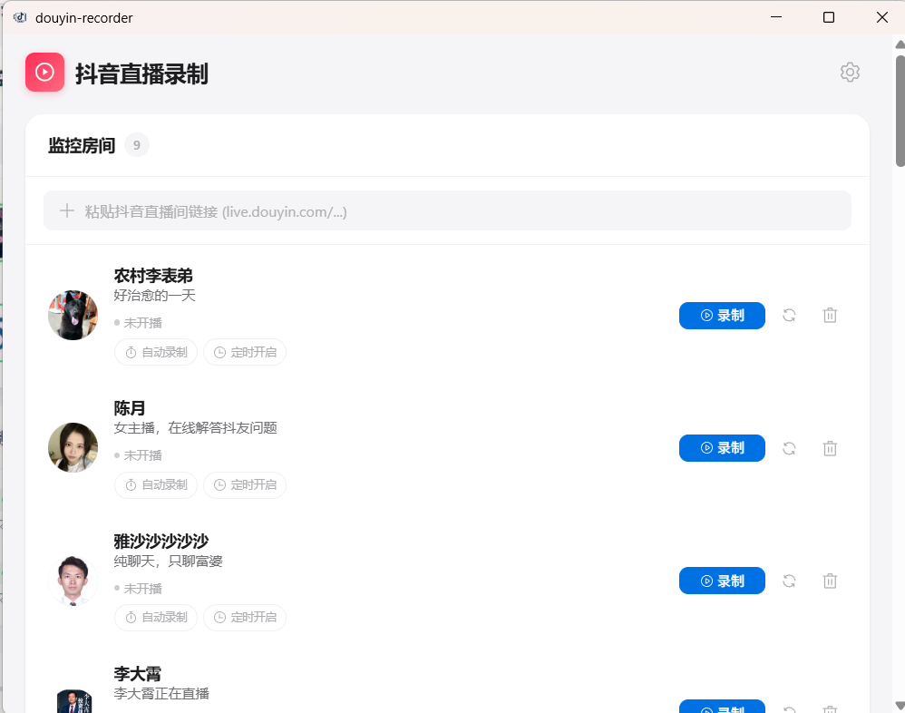
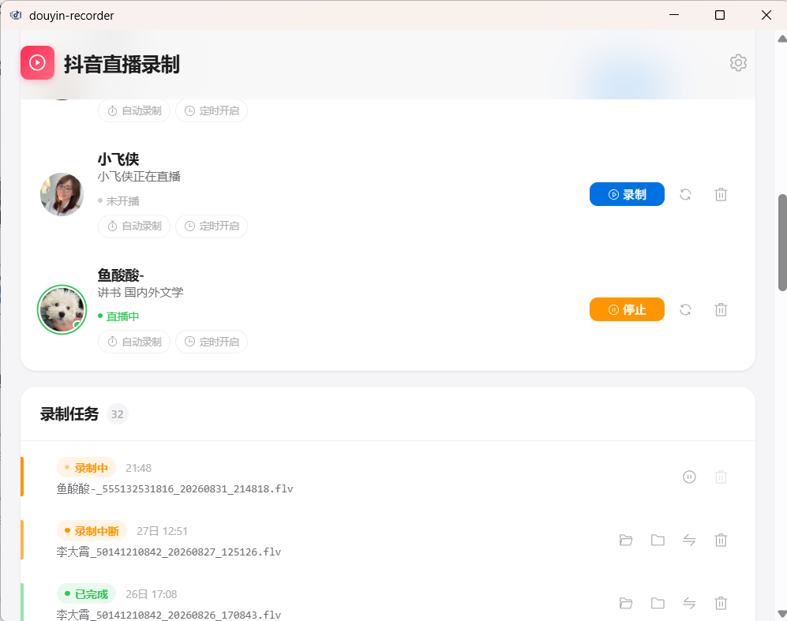
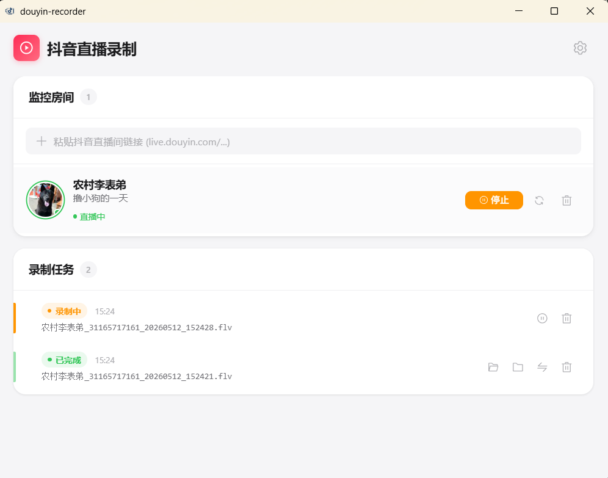
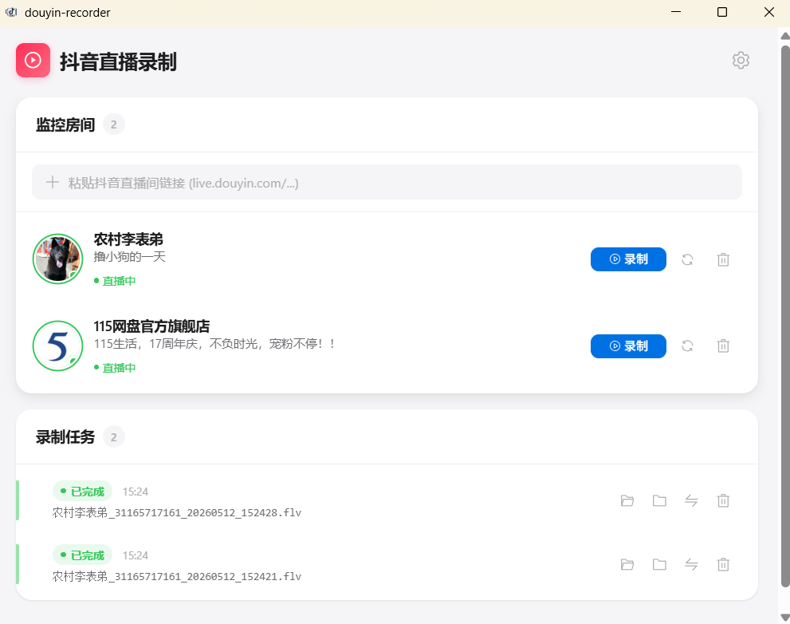

<div align="center">

# 抖音直播录制工具

**一款简洁优雅的抖音直播录制桌面工具**

监控直播间 | 自动与定时录制 | FLV 转 MP4 | 多画质选择


</div>

---

## ✨ 功能特性

- **直播间监控** - 添加抖音直播间链接，实时查看主播开播状态
- **一键录制** - 开播后点击录制，自动下载直播流
- **逐房间自动录制** - 为指定房间开启开播检测，检测到直播后自动开始录制
- **每日定时开启** - 限时监控下，可为每个房间设置每天固定时间开启一个自动监控窗口
- **持续监控** - 为不定时开播的房间持续等待，自动录制每一场；正常下播后继续等待，直到手动关闭
- **多画质支持** - 原画 / 蓝光 / 超清 / 高清 / 标清，按清晰度从高到低选择，新安装默认原画
- **FLV 转 MP4** - 录制完成后一键转换，支持自动转换
- **代理支持** - 可配置 HTTP 代理，适应不同网络环境
- **本地存储** - 数据保存在本地 SQLite 数据库，隐私安全
- **轻量桌面应用** - 基于 Tauri，体积小、启动快、资源占用低

## 群聊
QQ群：1126726612
问题答案是：douyinrecorder

## 📋截图

<div align="center">

> 主界面：直播间列表 + 录制任务管理
>
> 
>
> 
>
> 老版本：
>
> 
>
> 

</div>

---

## 📥 下载安装（普通用户）

> 🚀快速开始

### 第一步：下载

前往 [Releases](https://github.com/SplashedWhite/douyin-recorder/releases) 页面，下载最新版本的安装包：

| 系统 | 下载文件 |
|------|---------|
| **Windows** | `douyin-recorder_x.x.x_x64-setup.exe` |

### 第二步：安装

- **Windows**：双击 `.exe` 安装包，按提示完成安装

### 第三步：使用

1. 打开应用，在顶部输入框粘贴抖音直播间链接（格式：`https://live.douyin.com/房间号`）
2. 点击"添加"按钮，房间会出现在监控列表中
3. 等待主播开播（状态显示为绿色"直播中"），点击"录制"按钮
4. 录制完成后，在任务列表点击"转换为 MP4"即可

也可以在房间卡片中打开“录制设置”，选择监控方式，再开启“自动录制”：

- **限时监控（默认）**：在全局设置指定的窗口内等待开播；一直未开播则到期关闭。可以设置“每天 HH:mm”自动开启。“重新开始一个窗口”仅在正常录完一场后生效，不会在空等到期后自动续开。
- **持续监控**：一直等待开播，正常录完后继续等待下一场，不受窗口时长和限时录后选项影响。已有每日定时会保留，但持续模式期间不触发；切回限时模式后恢复，若当天时间已过则从次日生效。

保存录制设置不会开启或关闭自动录制。已开启时切换模式立即生效，切回限时模式从当前时间开始计算新窗口；正在录制的视频不会被打断。窗口时长、录完后的限时策略仍统一在右上角设置中调整。

**停止操作**：关闭“自动录制”只停止监控，当前视频继续录制。持续模式下，点击视频的“停止”会同时关闭该房间的监控，防止刚停止又自动重录；再次开启后才恢复。

持续模式遇到临时断流会保留已有文件，在等待后重新检测、获取新的直播地址并重试，异常文件仍标记为中断或失败。连续失败的等待时间逐渐增加，最长 15 分钟；平台限流等待 30 分钟。录制目录不可写或 FFmpeg 无法启动时会暂停监控，卡片显示原因，处理后需重新开启。切换模式不会取消已有的重试等待。

程序重启后恢复持续监控之前的开关状态。自动检测要求程序运行、电脑保持唤醒；不会唤醒休眠的电脑。自动录制关闭时不在后台轮询该房间，录制期间也不轮询，关播由 FFmpeg 断流自动收尾。

**关闭窗口与托盘**：在右上角设置中选择“点击关闭按钮时”的行为，保存后立即生效。

- **直接退出程序（默认）**：停止正在进行的录制，等待文件收尾、转换和结果保存完成后退出，不再弹出确认框。退出时保留各房间的自动监控设置。
- **关闭到系统托盘**：点击窗口的 × 后隐藏到托盘，不占用任务栏位置，录制、自动监控和定时任务继续运行。左键点击托盘图标或右键选择“显示主窗口”即可恢复；窗口恢复后托盘图标隐藏。右键“退出程序”会正常收尾后退出。

窗口打开或普通最小化时不显示托盘图标。再次打开软件会恢复已有窗口，不会重复启动。退出等待超时或结果保存失败时会保留程序并提示原因，请检查任务状态后重试。

录制文件默认保存在 `DouyinRecordings` 文件夹（可在设置中修改）。

> **提示**：如果网络正常访问抖音，无需额外配置代理。如果添加直播间失败，请确认使用的是完整的 `https://live.douyin.com/房间号` 格式链接。

---

## 应用设置

点击右上角齿轮图标打开设置面板：

| 设置项 | 说明 | 默认值 |
|--------|------|--------|
| **代理地址** | HTTP 代理 (如 `http://127.0.0.1:7890`) | 空 |
| **Cookie** | 浏览器 Cookie，用于绕过反爬 | 空 |
| **画质偏好** | 原画 / 蓝光 / 超清 / 高清 / 标清 | 原画（新安装） |
| **录制目录** | 录制文件保存位置 | `~/DouyinRecordings` |
| **数据库路径** | SQLite 数据库文件位置 | `~/.douyin-recorder/` |
| **自动转 MP4** | 录制停止后自动转换格式 | 关闭 |
| **24 小时制** | 时间显示格式 | 开启 |
| **开播检测间隔** | 自动录制开启时的状态检查间隔（10–3600 秒） | 60 秒 |
| **单次监控窗口** | 仅限时监控：到期仍未开播时自动停止请求（1–24 小时） | 6 小时 |
| **自动录完一场后** | 仅限时监控：关闭自动录制或重新开始一个窗口 | 关闭自动录制 |

## 画质说明

软件画质与抖音的五档名称对应，按 **原画 → 蓝光 → 超清 → 高清 → 标清** 排列。实际分辨率、帧率和码率由直播间提供，档位名称不是固定规格。

下表来自 **2026-09-12** 对[直播间 622667288226发财巨魔](https://live.douyin.com/622667288226) 的接口读取及视频流实测，仅供参考，不代表所有直播间：

| 画质 | 示例分辨率 | 示例帧率 | 说明 |
|------|------------|----------|------|
| **原画** | 1920 × 1080 | 60 fps | 优先获取接口的原画流，不代表无损或固定分辨率 |
| **蓝光** | 1920 × 1080 | 60 fps | 本次与原画的分辨率、帧率相同，不能仅凭这两项认定画面质量完全相同 |
| **超清** | 1280 × 720 | 60 fps | 本次与高清分辨率相同，但帧率更高 |
| **高清** | 1280 × 720 | 30 fps | 本次是 720p、30 fps |
| **标清** | 960 × 540 | 25 fps | 本次分辨率和帧率均低于其他四档 |

- 同样是 720p 或 1080p，仍可能有帧率、码率和压缩质量的差异；原画也不保证高于 1080p。
- 横竖屏尺寸随主播推流变化，例如横屏可能是 1280 × 720，竖屏可能是 720 × 1280。软件直接保存直播流，不进行缩放或重新编码；转为 MP4 也只更换封装格式。
- 本次五档均测得 **H.264 视频和 AAC 音频**。这只是该直播间当时返回的情况，没有办法据此认定为所有抖音直播间只提供这一种编码；但是本软件目前没有独立的编码格式选择，暂时是这一个，如果大家发现其他的编码格式了，还请提一下issue，会跟进的。
- 选定档位缺失时，先逐级向下降级；如果没有可用低档，再从最近的高档向上查找。例如选择超清时，依次尝试超清、高清、标清、蓝光、原画。同一档优先使用 SDK 主路 FLV、SDK 主路 HLS、旧接口 FLV、旧接口 HLS，不会因为低档有 FLV 就跳过高档的 HLS。这里的回退针对接口中缺失或为空的地址，不表示播放地址连接失败后会自动尝试所有档位。

### 旧版设置兼容

升级会保留已保存的档位，只修正显示名称；新安装、缺失或无效的画质设置默认使用原画。

| 当前名称 | 配置值 | 抖音 SDK 档位 | 旧版显示名称 |
|----------|--------|---------------|--------------|
| 原画 | `ORIGIN` | `origin` | 无（新增） |
| 蓝光 | `FULL_HD1` | `uhd` | 蓝光 |
| 超清 | `HD1` | `hd` | 高清 |
| 高清 | `SD2` | `sd` | 流畅 |
| 标清 | `SD1` | `ld` | 标清 |

**如果此前使用默认的 `HD1`，升级后会显示“超清”，不会自动切换到原画。希望优先获取原画时，请在设置中手动选择“原画”并保存；新的选择用于之后开始的录制。**

## 常见问题

**Q: 为什么添加直播间失败？**
A: 请确认使用的是 `https://live.douyin.com/房间号` 格式的完整链接，短链接暂不支持。

**Q: 录制的文件在哪里？**
A: 默认保存在用户目录下的 `DouyinRecordings` 文件夹，可在设置中修改。

**Q: 需要配置代理吗？**
A: 如果你的网络环境可以正常访问抖音，则不需要配置代理。

**Q: 支持哪些画质？**
A: 支持原画、蓝光、超清、高清、标清五档，新安装默认原画。具体参数由直播间提供，详见[画质说明](#画质说明)。

---

## 📄 许可证

[MIT](LICENSE)

本项目使用了 [FFmpeg](https://ffmpeg.org/) 作为录制引擎，详见 [第三方许可证声明](THIRD_PARTY_LICENSES.md)。

---

## 💬 反馈与贡献

如果你在使用过程中遇到任何问题，或者有好的建议，欢迎：

- 提交 [Issue](https://github.com/SplashedWhite/douyin-recorder/issues)
- 提交 Pull Request 参与开发
- 给项目点个 Star ⭐ 支持一下

---

## 开发指南

> 以下内容面向开发者，普通用户无需关注。

### 技术栈

| 层级 | 技术 |
|------|------|
| **前端** | Vue 3 + TypeScript + Element Plus + Pinia |
| **后端** | Rust + Tauri 2 |
| **数据库** | SQLite (rusqlite) |
| **录制引擎** | FFmpeg (sidecar) |
| **构建工具** | Vite 6 + pnpm |

### 环境要求

- [Node.js](https://nodejs.org/) (>= 18)
- [pnpm](https://pnpm.io/)
- [Rust](https://www.rust-lang.org/tools/install) (rustup + cargo)
- [Tauri CLI](https://tauri.app/) (开发依赖，会自动安装)
- [FFmpeg](https://ffmpeg.org/) (录制引擎，需要单独下载)

### FFmpeg 配置

本项目使用 FFmpeg 作为录制引擎，以 sidecar 方式打包。由于 FFmpeg 二进制文件较大（约 200MB），不包含在 git 仓库中，需要手动下载并放置。

**下载 FFmpeg：**

1. 访问 FFmpeg 官方下载页面：https://ffmpeg.org/download.html
2. 选择适合你操作系统的版本：
   - **Windows**：下载 Windows 版本（推荐使用 [gyan.dev](https://www.gyan.dev/ffmpeg/builds/) 的构建版本）
   - **macOS**：使用 Homebrew 安装 (`brew install ffmpeg`) 或下载静态构建版本
   - **Linux**：使用包管理器安装或下载静态构建版本

**放置 FFmpeg：**

将下载的 FFmpeg 可执行文件放置到以下目录：

```
src-tauri/binaries/
```

**文件命名规则：**

FFmpeg 二进制文件需要按照 Tauri sidecar 的命名规则放置：

| 操作系统 | 目标平台 | 文件名 |
|---------|---------|--------|
| Windows | x86_64 | `ffmpeg-x86_64-pc-windows-msvc.exe` |
| Windows | x86 (32位) | `ffmpeg-i686-pc-windows-msvc.exe` |
| macOS | Intel | `ffmpeg-x86_64-apple-darwin` |
| macOS | Apple Silicon | `ffmpeg-aarch64-apple-darwin` |
| Linux | x86_64 | `ffmpeg-x86_64-unknown-linux-gnu` |
| Linux | ARM64 | `ffmpeg-aarch64-unknown-linux-gnu` |

**示例（Windows）：**

```bash
# 创建 binaries 目录（如果不存在）
mkdir -p src-tauri/binaries

# 将下载的 ffmpeg.exe 重命名并移动到正确位置
mv ffmpeg.exe src-tauri/binaries/ffmpeg-x86_64-pc-windows-msvc.exe
```

**验证配置：**

```bash
# 测试 FFmpeg 是否可用
./src-tauri/binaries/ffmpeg-x86_64-pc-windows-msvc.exe -version
```

> **注意**：如果你只需要在当前平台开发和构建，只需下载对应平台的 FFmpeg 版本即可。如果需要跨平台构建，需要下载所有目标平台的版本。

### 安装与运行

```bash
# 1. 克隆项目
git clone https://github.com/SplashedWhite/douyin-recorder.git
cd douyin-recorder

# 2. 安装依赖
pnpm install

# 3. 启动开发模式
pnpm tauri dev
```

### 构建发布版本

```bash
pnpm tauri build
```

构建完成后，安装包将输出到 `src-tauri/target/release/bundle/` 目录。

### 项目结构

```
douyin-recorder/
├── src/                        # 前端源码
│   ├── components/             # Vue 组件
│   │   ├── RoomList.vue        #   直播间列表
│   │   ├── TaskList.vue        #   录制任务列表
│   │   └── Settings.vue        #   设置面板
│   ├── stores/                 # Pinia 状态管理
│   └── types/                  # TypeScript 类型定义
├── src-tauri/                  # 后端源码
│   ├── src/
│   │   ├── lib.rs              #   核心逻辑 & Tauri 命令
│   │   ├── parser.rs           #   抖音 API 解析
│   │   ├── recorder.rs         #   FFmpeg 录制管理
│   │   ├── auto_policy.rs      #   监控模式、定时与录后策略
│   │   ├── auto_recorder.rs    #   自动录制检查间隔与退避管理
│   │   ├── database.rs         #   SQLite 数据库层
│   │   └── settings.rs         #   配置管理
│   ├── binaries/               # FFmpeg sidecar 二进制（需手动下载）
│   └── tauri.conf.json         # Tauri 配置
├── package.json
└── vite.config.ts
```
